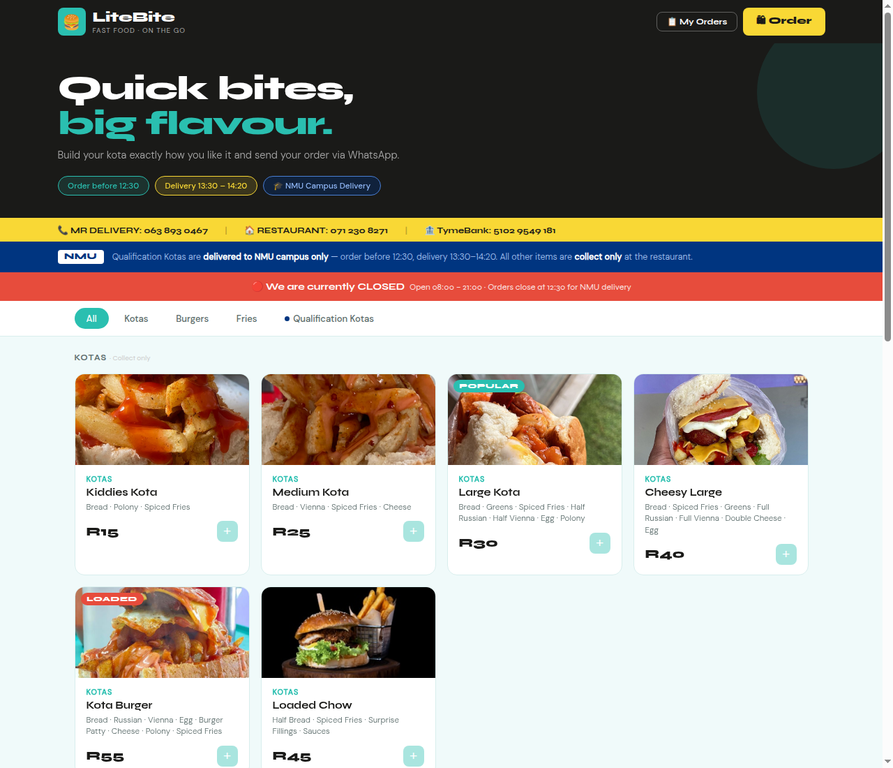

# Bapela Digital Systems

<p align="center">
  
</p>

<p align="center"><strong>Digital systems that make small businesses easier to run.</strong></p>

<p align="center">
  <a href="https://bapeladigital.co.za">Live website</a> ·
  <a href="https://litebite.netlify.app/">LiteBite ordering platform</a> ·
  <a href="https://github.com/beanboy908">GitHub profile</a>
</p>

Bapela Digital Systems is a portfolio and delivery studio focused on practical web infrastructure, responsive interfaces, automation, and business systems for South African organisations. The work combines clean user experiences with dependable, understandable implementation.

## Featured project: LiteBite

[LiteBite Fast Food](https://litebite.netlify.app/) is a mobile-first ordering experience designed for fast-food customers and NMU campus delivery. Customers can browse categories, customise kota ingredients, add items to an order, and send the order through WhatsApp. The site also presents delivery windows, collection rules, add-on sides, and an order-history lookup flow.



The project is a useful example of product thinking beyond a static landing page: it brings together catalogue structure, pricing, category filtering, customisation, ordering, and operational information in one responsive experience.

## Portfolio projects

| Project | What it demonstrates | Links |
|---|---|---|
| **Campus Service Desk** | A full-stack facility and support request system with student, staff, and administrator roles; SQL-backed requests; assignment workflows; status history; notes; dashboards; and automated tests. | [Repository](https://github.com/beanboy908/campus-service-desk) |
| **StockPilot Inventory Platform** | Inventory decision logic, reorder calculations, REST endpoints, SQL schema design, and tests around operational rules. | [Repository](https://github.com/beanboy908/stockpilot-inventory-platform) |
| **DataSentinel JSON CLI** | A developer-focused command-line tool for JSON quality checks, machine-readable validation output, transformations, and `jq` interoperability. | [Repository](https://github.com/beanboy908/datasentinel-json-cli) |
| **StudyPlan Scheduler Engine** | Deterministic scheduling with priorities, capacity constraints, deadline explanations, JSON contracts, and tests. | [Repository](https://github.com/beanboy908/studyplan-scheduler-engine) |
| **Yvonne Cleans** | A service-business web experience with a clear customer-facing presentation. | [Repository](https://github.com/beanboy908/YVONNE-CLEANS) |
| **Nails by Aimee** | A focused beauty-service website with a concise, conversion-oriented presentation. | [Repository](https://github.com/beanboy908/nails-by-aimee) |

## Capability areas

The portfolio spans responsive frontend development, backend workflows, SQL data modelling, REST and JSON interfaces, command-line tooling, deterministic algorithms, automated testing, and practical business communication. The projects are intentionally varied: together they show both product-facing craft and engineering fundamentals.

## Bapela website

The agency website is available at [bapeladigital.co.za](https://bapeladigital.co.za). The current repository contains the static marketing site and can be opened locally without a build step:

```bash
git clone https://github.com/beanboy908/bapela-digital-systems.git
cd bapela-digital-systems
# Open index.html in a modern browser
```

## Working principles

Bapela projects are built around clear user journeys, responsive layouts, maintainable structure, transparent data flows, and documentation that makes the work easy to understand. Project descriptions distinguish implemented features from future ideas, and the repository collection is intended to make the engineering process visible to prospective clients and employers.

## Contact and links

- [Bapela Digital Systems](https://bapeladigital.co.za)
- [LiteBite Fast Food](https://litebite.netlify.app/)
- [GitHub profile](https://github.com/beanboy908)
